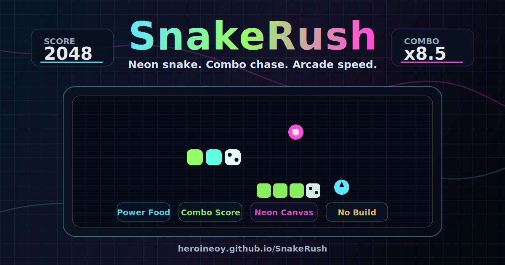

<p align="center">
  
</p>

<h1 align="center">SnakeRush</h1>

<p align="center">
  A neon arcade snake game with multiple modes, difficulty tuning, combo scoring, power food, local leaderboards, swipe controls, and synth-style browser audio.
</p>

<p align="center">
  <a href="https://heroineoy.github.io/SnakeRush/"><strong>Play Online</strong></a>
  |
  <a href="https://github.com/HeroineOY/SnakeRush">GitHub Repo</a>
</p>

<p align="center">
  
  
  
  
</p>

## Why It Stands Out

- Fast browser play with no install, build step, or dependencies.
- Five modes: Classic, Rush, Portal, Wall, and Zen.
- Three difficulty levels with separate local leaderboards.
- Polished neon interface with animated canvas rendering and responsive controls.
- Combo-based scoring that rewards clean movement and aggressive food chasing.
- Special food types, slow-time effects, double-score windows, poison risk, particle bursts, and growing obstacles.
- Keyboard, swipe, touch, and on-screen direction controls for desktop and mobile.
- Lightweight synth sound effects and adaptive background music.

## Play

Open the live version:

```text
https://heroineoy.github.io/SnakeRush/
```

Or run locally by opening `index.html` in your browser.

## Controls

| Action | Keyboard | Touch / Mouse |
| --- | --- | --- |
| Move | Arrow keys or WASD | Direction pad |
| Swipe move | - | Swipe on the board |
| Boost | Shift | Boost button |
| Start | Enter or Space | Start button |
| Pause | Enter or Space | Pause button |
| Restart | Restart button | Restart button |
| Sound | Sound button | Sound button |

## Project Structure

```text
.
+-- assets/
|   +-- cover.svg
+-- game.js
+-- index.html
+-- style.css
+-- README.md
```

## Tech Stack

- HTML canvas for the board, snake, food, particles, and scanline effects.
- CSS for the responsive neon arcade layout.
- Vanilla JavaScript for game state, collisions, scoring, animation, and audio.

## Repository

Built as a small, deployable web game: clone it, open it, play it.
